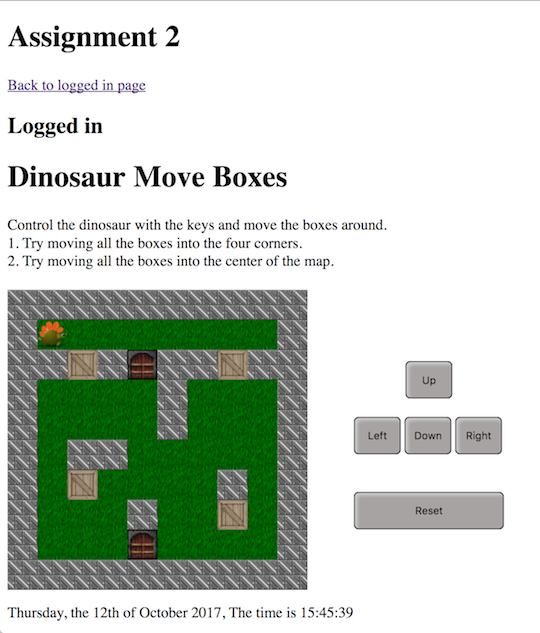
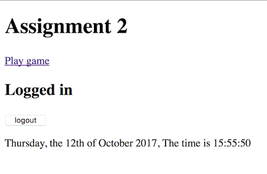
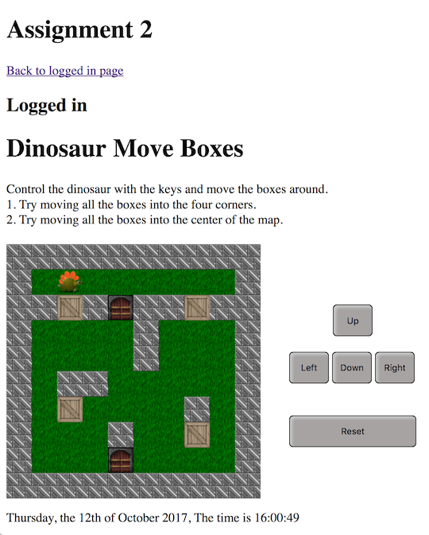
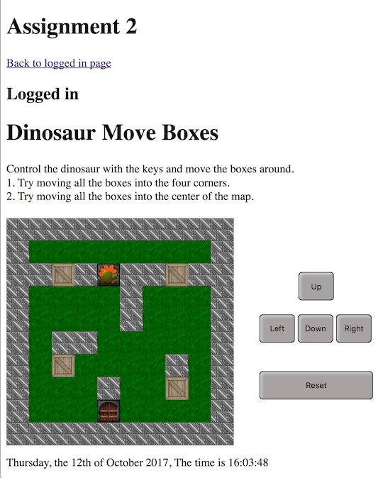
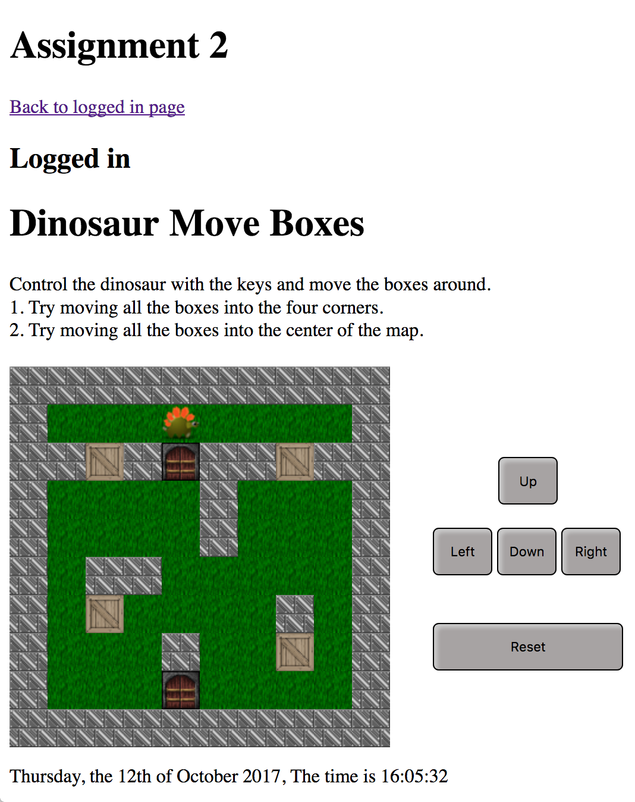
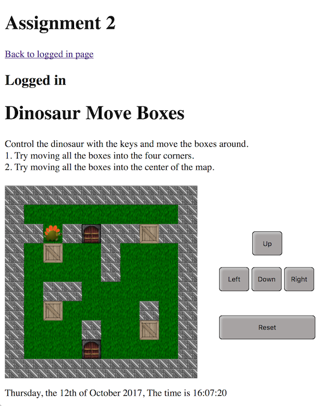
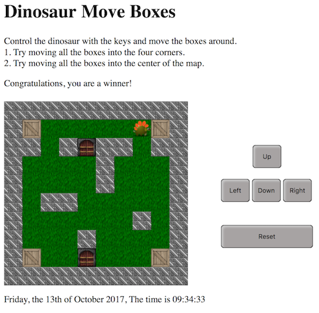
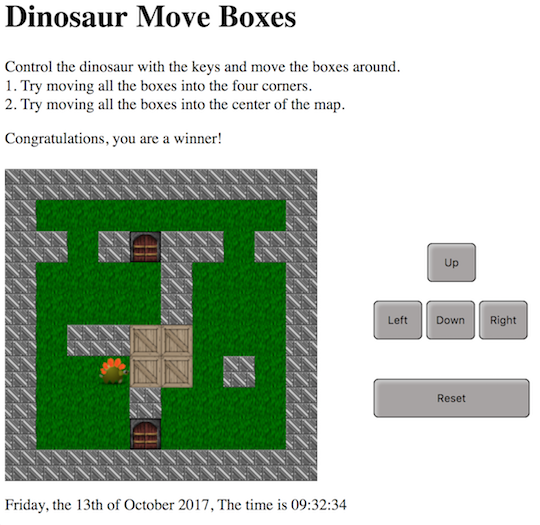

# Login_1DV610
Interface repository for 1DV610 assignment L3. Requirements and Code Quality.  
Estimated score on assignment: 100%  
According to the auto tests: http://csquiz.lnu.se:25083/index.php  
On public server here: http://professorpotatis.000webhostapp.com/index.php

## Installation
1. Download and install a MAMP, WAMP or LAMP.
2. Download the repository.
3. Put the repository in your MAMP/WAMP/LAMP folder htdocs.
4. Start the MAMP/WAMP/LAMP.
5. Go to the MAMP/WAMP/LAMP phpMyAdmin and create a mySQL database:

    ### Create a mySQL database
    Add table namned Users.  
    The table should contain three columns.  
    First column: username, varchar(20), utf8mb4_unicode_ci.  
    Second column: password, varchar(255), utf8mb4_unicode_ci.  
    Third column: cookie, varchar(255), utf8mb4_unicode_ci.

6. In your MAMP/WAMP/LAMP folder htdocs, go to the model folder.
7. Create a DBConfig.php file and save it to the model folder:

    ### Create a DBConfig.php file
    Add the information for your mySQL database.  
    ```php
    <?php

    $db_host = 'localhost';
    $db_user = 'username';
    $db_password = 'password';
    $db_name = 'dbname';
    ```

8. In your browser, go to localhost:8888/sk222uf-1dv610-L3/index.php.
9. DONE!

***

# Extra functionality
A game that I have named "Dinosaur Move Boxes".  

## Play "Dinosaur Move Boxes"
When logged in to the system:  
1. Click link "Play game".
2. Follow the instructions on the page.

## Extra use cases
Building upon the use cases presented here:  
https://github.com/dntoll/1dv610/blob/master/assignments/A2_resources/UseCases.md

***

### UC5 Play a game
#### Preconditions
A user is authenticated. Ex. UC1, UC3.
#### Main scenario
1. Starts when a user wants to play a game.
2. The system present a play game choice.
3. User tells the system he/she wants to play a game.
4. The system present a game.

***

### UC6 Continue to play a game
#### Preconditions
A user is authenticated. Ex. UC1, UC3.  
A user has previously started to play a game. Ex. UC5.
#### Main scenario
1. Starts when a user wants to continue to play a game.
2. The system present a play game choice.
3. User tells the system he/she wants to play a game.
4. The system present the previously started game.

***

### UC7 Reset a game
#### Preconditions
A user is authenticated. Ex. UC1, UC3.  
A user has previously started to play a game. Ex. UC5, UC6.
#### Main scenario
1. Starts when a user wants to reset the game.
2. The system present a reset game choice.
3. User tells the system he/she wants to reset the game.
4. The system present a reset game.

***

### UC8 Win a game
#### Preconditions
A user is authenticated. Ex. UC1, UC3.  
A user has previously started to play a game. Ex. UC5, UC6.
#### Main scenario
1. Starts when a user wants to win the game.
2. The system present a game with instructions how to win.
3. User plays the game according to the instructions.
4. The system present a winner message.

***

## Extra manual test cases
Building upon the test cases presented here:  
https://github.com/dntoll/1dv610/blob/master/assignments/A2_resources/TestCases.md

***

### Test case 5.1, Show Game Area
When user wants to play a game, a game area should be shown.
#### Input:
* Test case 1.7  
* Press "Play game"
#### Output:
* A button/link with text "Back to logged in page" is shown.
* The text "Logged in" is shown.
* The text "Dinosaur Move Boxes" is shown.
* Instructions how to play the game is shown.
* A game map is shown.
* A keypad is shown.
* A reset button/link is shown.



***

### Test case 5.2, Back to logged in page
#### Input:
* Test case 5.1, Show Game Area
* Press "Back to logged in page"
#### Output:
* A button/link with text "Play game" is shown.
* The text "Logged in" is shown.
* A logout button is shown.



***

### Test case 5.3, Move dinosaur to the right
#### Input:
* Test case 5.1  
* Press keypad "Right"
#### Output:
* Dinosaur moves one tile to the right.
* Dinosaur is faced to the right.



***

### Test case 5.4, Move dinosaur to the left
#### Input:
* Test case 5.1 and 5.3  
* Press keypad "Left"
#### Output:
* Dinosaur moves one tile to the left.
* Dinosaur is faced to the left.


***

### Test case 5.5, Move dinosaur down
#### Input:
* Test case 5.1  
* Press keypad "Right" 3 times
* Press keypad "Down"
#### Output:
* Dinosaur moves one tile down.



***

### Test case 5.6, Move dinosaur up
#### Input:
* Test case 5.5  
* Press keypad "Up"
#### Output:
* Dinosaur moves one tile up.



***

### Test case 5.7, Move box with dinosaur
#### Input:
* Test case 5.6  
* Press keypad "Left" 2 times
* Press keypad "Down"
#### Output:
* Dinosaur moves one tile down.
* Box moves one tile down.



***

### Test case 5.8, Move dinosaur through door
#### Input:
* Test case 5.5  
#### Output:
* Dinosaur moves through door.


***

### Test case 6.1, Continue to play previous game
#### Input:
* Test case 5.7  
* Press "Back to logged in page"
* Press "Play game"
#### Output:
* Previous game play is rendered.


***

### Test case 7.1, Reset a game
#### Input:
* Test case 5.7
#### Output:
* The game is reset.


***

### Test case 8.1, Win a game (corners)
#### Input:
* Test case 5.1
* Push boxes into the four corners.
#### Output:
* A message "Congratulations, you are a winner!" is shown.



***

### Test case 8.2, Win a game (center)
#### Input:
* Test case 5.1
* Push boxes into the center.
#### Output:
* A message "Congratulations, you are a winner!" is shown.


